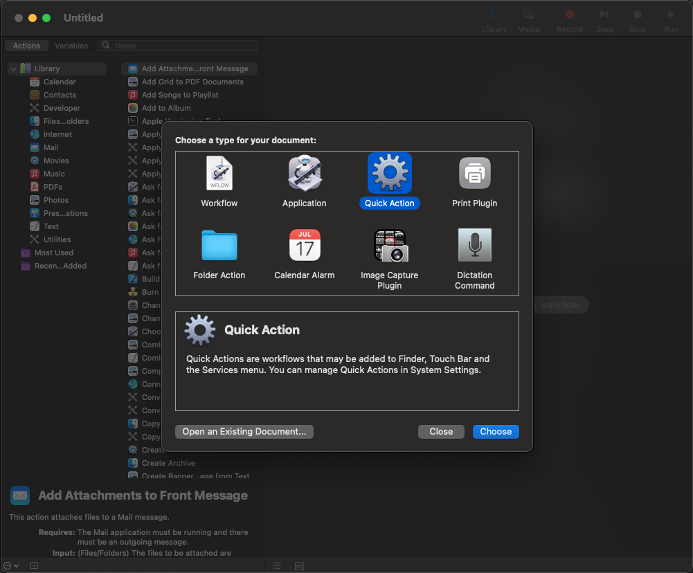
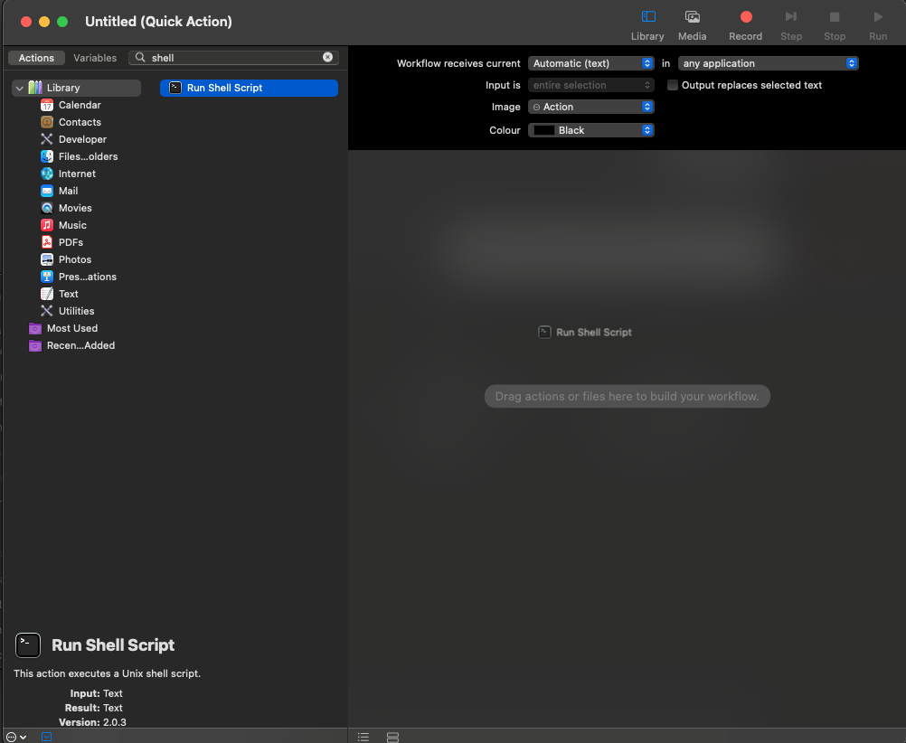
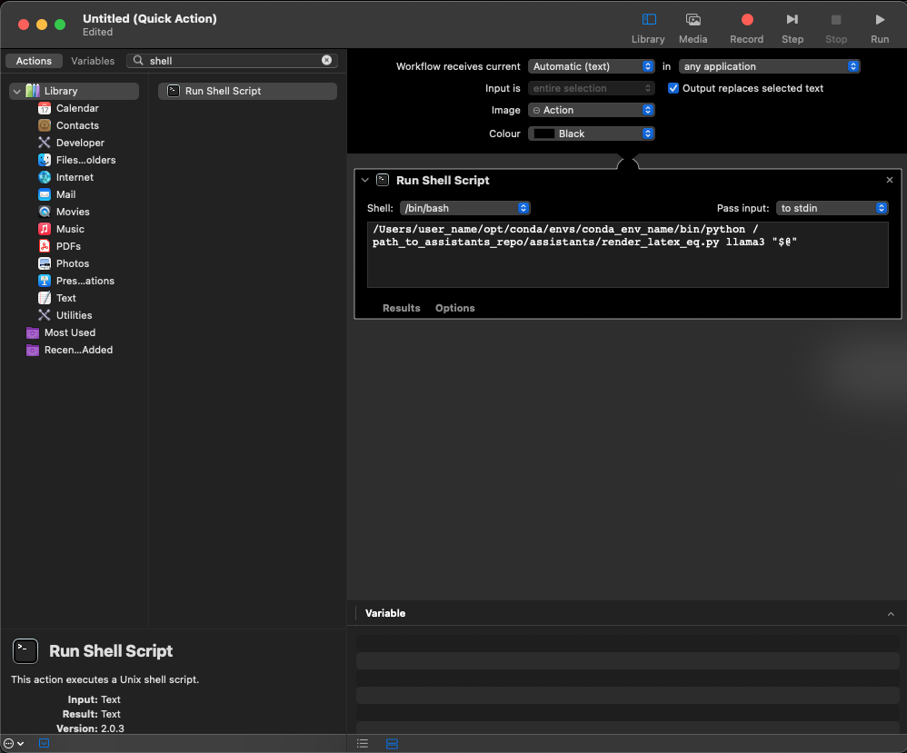
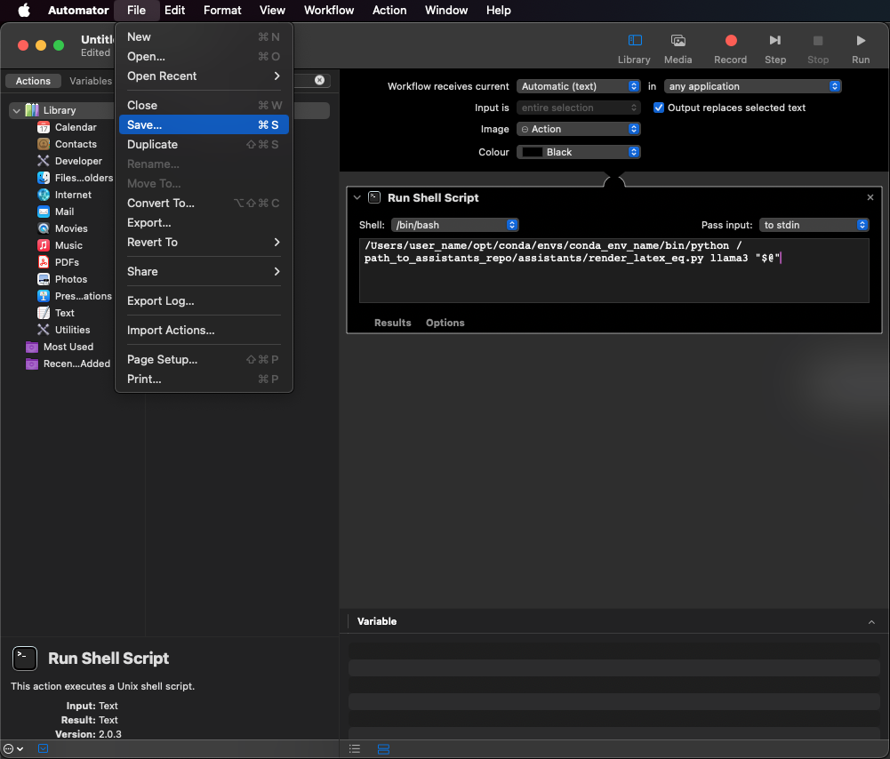
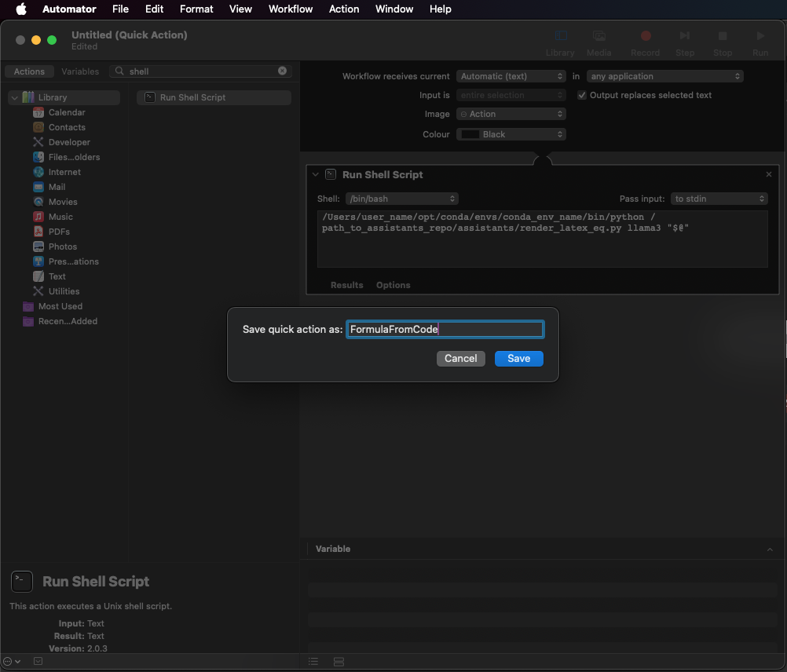

## Local AI Assistants to The People

How to implement LLMs locally as quick actions using `llama-index` (on Mac).

### Pre-requisites

- Istall [Ollama](https://ollama.com/download)
- Create a `conda` environment using `reqiuirements.txt` like so: 

```shell
conda create -n env_name python=3.12
conda activate env_name
pip install -r requirements.txt
```

### 2. Create a quick action in using Automator on Mac

#### 2.1. Open Automator and pick "Quick Action"

The quick action you configure will show in any application where text input is possible (text editor, browser, etc.)

<figure>
    
</figure>

#### 2.2. Create a shell command which will call the Python script

Search `Run Shell Script` in the Library using the search tool and drag and drop this option in your quick action.

<figure>
    
</figure>

#### 2.3. Configure the shell command

The command should call the Python script using the Python executable in the `conda` environment you had configured earlier. The script takes two arguments: 
- `model`: the name of the model fetched by `llama_index`. This is only limited by your hardware.

<span style="color:red">**Note**: Before setting up a quick action, make sure the model has been downloaded on your machine. You can download the model you want to use by running the following command: `ollama pull model_name`.</span>

```shell
- `input`: text input the model takes (not the same as prompt). In the case of `render_latex_eq.py`, the input is Python code performing maths operations.

<figure>
    
</figure>


#### 2.4. Save the quick action

<div style="display: flex; justify-content: space-around;">
    <figure style="margin: 10px;">
        
    </figure>
    <figure style="margin: 10px;">
        
    </figure>
</div>

### 3. Profit

Here's an example of how you can render a $\LaTeX\$ formula from your code directly in Overleaf (or any other text editor):


